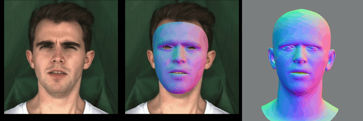
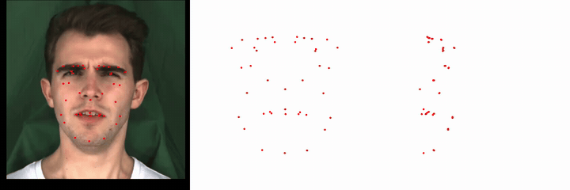

# Advanced Face Tracking Algorithm

This is the 3D face tracking algorithm adopted in our [PerformRecast](https://youku-aigc.github.io/PerformRecast/) paper. Our implementation achieves more accurate video face-tracking results than [Pixel3DMM](https://simongiebenhain.github.io/pixel3dmm/) in less time.

## Demo

Both clips below are produced end-to-end from the bundled `data/test.mp4`
by running `python3 scripts/track_video.py --video data/test.mp4 --output-dir results`.

**Result of face tracking**



**Keypoint visualisation**



Given a video and pre-computed 2D facial landmarks, it produces:

- per-frame FLAME shape / expression / pose / camera parameters
- per-frame canonical / expression / projected 3D keypoints
- a debug visualisation video (`vis_kp.mp4`) and a rendered overlay (`result.mp4`)
- (optional) per-frame `.obj` meshes

## Repository layout

```
face_tracking/
├── face_tracking/            # importable Python package
│   ├── api.py                #   high-level track_video / track_videos API
│   ├── env_paths.py          #   asset/path resolution (env-var-overridable)
│   ├── preprocessing/        #   cropping, segmentation, network inference
│   ├── lightning/            #   p3dmm prediction networks
│   ├── tracking/             #   tracker, FLAME, renderer, losses
│   └── utils/                #   helpers (device, drawing, masking, vis, ...)
├── scripts/
│   ├── track_video.py        #   single-video CLI
│   ├── track_batch.py        #   batch CLI (directory or list file)
│   └── download_weights.sh   #   fetch pretrained checkpoints
├── configs/
│   ├── tracking.yaml
│   └── base.yaml
└── assets/                   #   FLAME UV / mirror / mask / template files
```

## Installation

Tested on Python 3.12, CUDA 12.8, PyTorch 2.11 with NVIDIA GPUs.

```bash
# 1. Create an environment
conda create -n face_tracking python=3.12 -y
conda activate face_tracking

# 2. Install PyTorch (CUDA 12.8 build).
#    On Linux + CUDA, this also pulls Triton (used by the tracker's
#    custom GPU kernels for FLAME blendshapes / 6D rotation).
pip3 install torch==2.11.0 torchvision==0.26.0 torchaudio==2.11.0 --index-url https://download.pytorch.org/whl/cu128

# 3. Install differentiable-rendering dependencies
pip3 install git+https://github.com/facebookresearch/pytorch3d.git@stable
pip3 install git+https://github.com/NVlabs/nvdiffrast.git

# 4. Install this package and its remaining deps
pip3 install -r requirements.txt
pip3 install -e .
```

> **GPU requirement.** The tracker uses both nvdiffrast (CUDA-only) and
> a couple of small Triton kernels, so a CUDA-capable NVIDIA GPU is
> required at runtime. CPU / MPS execution is not supported for the
> tracker, even though the cropper and the network heads will run.

### Download Pretrained Weights

```bash
bash scripts/download_weights.sh
```

This single command downloads every checkpoint the tracker needs:

| File | Origin |
| --- | --- |
| `normals.ckpt` | [Pixel3DMM](https://simongiebenhain.github.io/pixel3dmm/) — surface-normal prior |
| `SegFace.pt` | [SegFace](https://github.com/Kartik-3004/SegFace) — face parser |
| `swin_b-68c6b09e.pth` | torchvision Swin-B backbone (used by SegFace) |
| `vit_base_patch16_224.dino.safetensors` | DINO ViT backbone (used by Pixel3DMM) |
| `FLAME2020/generic_model.pkl` | [FLAME](https://flame.is.tue.mpg.de/) 2020 generic model |
| `landmark.onnx` | [LivePortrait](https://github.com/KwaiVGI/LivePortrait) — 203-points face landmark refiner (auto-detect mode only) |
| `insightface/models/buffalo_l/` | [InsightFace](https://github.com/deepinsight/insightface) — RetinaFace detector + 2d-106 landmarks (auto-detect mode only). Downloaded as a zip and unpacked automatically. |

After running the script you'll have:

```
pretrained_weights/
├── normals.ckpt
├── SegFace.pt
├── swin_b-68c6b09e.pth
├── vit_base_patch16_224.dino.safetensors
├── landmark.onnx
├── FLAME2020/
│   └── generic_model.pkl
└── insightface/
    └── models/
        └── buffalo_l/
            ├── 1k3d68.onnx
            ├── 2d106det.onnx
            ├── det_10g.onnx
            ├── genderage.onnx
            └── w600k_r50.onnx
```

> `FLAME_masks.pkl` and `landmark_embedding.npy` ship in this repository
> under `assets/` and are loaded automatically as a fallback, so they do
> not need to be downloaded separately.

> **License note**: by downloading `generic_model.pkl` you agree to the
> non-commercial [FLAME license](https://flame.is.tue.mpg.de/modellicense.html).
> The other checkpoints are governed by their respective upstream licences.

Or you can place the weights anywhere and point `FACE_TRACKING_PRETRAINED` at that directory:

```bash
export FACE_TRACKING_PRETRAINED=/data/face_tracking/pretrained_weights
```

## Usage

The pipeline runs in **auto-detect mode by default**: pass only a video and the bundled face-cropper (RetinaFace + a 203-points ONNX landmark refiner, vendored from [LivePortrait](https://github.com/KwaiVGI/LivePortrait)) takes care of cropping and landmarking. If you already have your own landmarks, pass them and the cropper is skipped.

### Python API

```python
from face_tracking import track_video, track_videos

# Auto-detect — landmarks computed for you
result = track_video("data/test.mp4", output_dir="results")
print(result)

# External landmarks — bring your own [T, 203, 2] .npy
result = track_video(
    video_path="data/test.mp4",
    landmark_path="data/test.npy",
    output_dir="results",
)

# Batch — mix-and-match: pass None to auto-detect, or a path to use external lmks
pairs = [
    ("data/test.mp4", None),
    ("data/test.mp4", "data/test.npy"),
]
results = track_videos(pairs, output_dir="results")
```

### Command line

Single video with auto-detect mode (the bundled `data/test.mp4` is a good first run):

```bash
python3 scripts/track_video.py --video data/test.mp4 --output-dir results
```

Single video with external landmarks:

```bash
python3 scripts/track_video.py \
    --video data/test.mp4 \
    --landmark data/test.npy \
    --output-dir results
```

Batch from a directory (auto-detect every video):

```bash
python3 scripts/track_batch.py --video-dir data/videos --output-dir results
```

Batch from a directory with matching landmarks:

```bash
python3 scripts/track_batch.py \
    --video-dir data/videos \
    --landmark-dir data/landmarks \
    --output-dir results
```

Batch from a list file. Each non-empty line of `pairs.txt` is one of:

* ``video_path`` — auto-detect landmarks for this video, or
* ``video_path landmark_path`` — use the supplied ``[T, 203, 2]`` ``.npy``.

Example `pairs.txt`:

```
data/clip01.mp4
data/clip02.mp4    data/clip02.npy
data/clip03.mp4
```

Run:

```bash
python3 scripts/track_batch.py --list pairs.txt --output-dir results
```

Useful flags:

- `--save-meshes` — also dump per-frame `.obj` meshes (slow, large).
- `--remove-intermediate` — clean up `preprocessed_data/<name>/` after tracking.
- `--iters 800` — increase per-frame iterations (recommended for single-image fitting).

### Distributed batch tracking

For long lists, use `scripts/track_distributed.py` with `torchrun`. Each
worker pulls one task at a time from a shared `torch.distributed.TCPStore`
counter, so faster GPUs naturally pick up more work and stragglers don't
block the queue.

About `--tag` — every run writes two log files under `--output-dir`:
`success_<tag>.txt` (videos that finished cleanly) and
`failed_<tag>.txt` (videos that errored out), one ``video_path
[landmark_path]`` per line. The `<tag>` is just a short name you pick
to keep multiple runs from clobbering each other's logs (e.g.
`vfhq_eval`, `nersemble_v2`). It defaults to `run` if omitted.

The same logs power `--resume`: re-running the script with the same
`--tag` reads both files into a set and skips any pair already in
there, so a crashed or interrupted run can be re-launched with the
exact same command line and pick up where it left off.

Single host, 4 GPUs (NCCL, one process per GPU):

```bash
torchrun --nproc_per_node=4 scripts/track_distributed.py \
    --list pairs.txt \
    --output-dir results/ \
    --tag vfhq_eval \
    --resume
```

Multi-host, 8 GPUs each:

```bash
torchrun --nnodes=2 --nproc_per_node=8 \
    --rdzv_endpoint=master.host:29500 \
    scripts/track_distributed.py \
    --list pairs.txt --output-dir results/
```

Multiple processes sharing one GPU (gloo backend, useful when one model
fits in a fraction of the GPU's memory):

```bash
torchrun --nproc_per_node=8 scripts/track_distributed.py \
    --list pairs.txt --output-dir results/ \
    --multi-process-per-gpu
```

The script falls back to a single-process run when launched without
`torchrun`, which is convenient for debugging and tiny lists.

### Outputs

For an input video `data/test.mp4`, you will find:

```
<output-dir>/test/
├── checkpoint/             # raw tracker checkpoints (FLAME params per frame)
├── key_points/             # FLAME-mesh keypoints exported per frame
│   ├── canonical_kp.npy    # 3D vertices in canonical pose       [T, K, 3]
│   ├── exp_kp.npy          # 3D vertices with expression         [T, K, 3]
│   ├── exp_delta.npy       # expression-only deltas              [T, K, 3]
│   └── kp.npy              # projected 2D screen-space keypoints [T, K, 3]
├── mesh/                   # (--save-meshes) per-frame .obj files
├── result.mp4              # FLAME mesh overlaid on the cropped frames
├── single.mp4              # FLAME mesh rendered on its own
└── vis_kp.mp4              # side-by-side keypoint debug video
```

#### FLAME-mesh keypoint semantics

The four `key_points/*.npy` files are the most important output for downstream tasks (animation, retargeting, training). Every file has shape `[T, K, 3]` where `T` is the number of video frames and **K = 1789 — the entire face region of the FLAME mesh** (1787 face-region vertices from `FLAME_masks.pkl['face']` + 2 iris-centre vertices). These are *dense* vertex tracks, not sparse landmarks.

| File | What it is |
| --- | --- |
| `canonical_kp.npy` | 3D positions of the K face vertices in the **identity-only** FLAME mesh (no expression, no head pose, no neck rotation). The same array repeats across `T` if the subject identity is fixed. Use this as the *neutral* template. |
| `exp_kp.npy` | The same vertices **with the per-frame expression and jaw/eye pose** applied, but still in canonical head/neck pose. This is the "animated identity" useful as a driving signal. |
| `exp_delta.npy` | `exp_kp − canonical_kp`. The **expression-only deformation** field; identity-agnostic, transferrable across actors. |
| `kp.npy` | The same K vertices projected into the **2D image plane** of the cropped frame (in `[0, cfg.size]` pixel coordinates). The third channel carries depth, so the array is `[T, K, 3]`. |

Vertex order: `flame_mesh_mask['face']` (1787 entries, ascending) then the two iris indices `4597` (left iris centre) and `4051` (right iris centre). Construction lives in `face_tracking/tracking/tracker.py` (`self.vertex_face`).

#### Sparse 40-point landmark subset (debug / visualisation only)

Within the dense 1789-vertex output, a curated set of **40 semantic
landmark points** is also defined. **These 40 points are not the loss
set** — they are *only* used for the `vis_kp.mp4` overlay and (when
`--save-meshes` is passed) the per-frame `mesh/landmarks_<frame>_<view>.npy`
debug dumps.

The 40 visualisation points are picked from the 5023-vertex FLAME
template as follows:

| Region | # | FLAME-mesh indices (into the 5023-vertex template) |
| --- | --- | --- |
| Lips (counter-clockwise from left corner) | 8 | `[2840, 2892, 3509, 1789, 1723, 1740, 3533, 2855]` |
| Left / right eyebrow | 6 / 6 | `[3763, 336, 3153, 3705, 2178, 2177]` + mirrored |
| Left / right eye centre | 1 / 1 | `[2495]` / `[1344]` |
| Left / right iris centre | 1 / 1 | `[4597]` / `[4051]` |
| Left / right face contour | 5 / 5 | `[3710, 3743, 3116, 3467, 3465]` + mirrored |
| Nose | 3 | `[3093, 3551, 2058]` |
| Jaw / chin contour | 3 | `[3408, 3404, 3624]` |
| **Total** | **40** | |

To get the 40-point subset out of the 1789-vertex array, slice with the
indices defined in `face_tracking/utils/vis_kp.py::selected_indices`
(which maps the 5023-space indices above into 1789-space).

## Input format

### Video

Any container readable by `mediapy` / OpenCV. Resolution requirements depend on the mode you use:

* **Auto-detect mode** (default) — input video can be **any resolution / aspect ratio**. The bundled cropper detects the face, computes a single stable bbox averaged across frames, and re-crops every frame to **512×512**. You can give it a wide shot and it will still work.
* **External-landmark mode** — frames are saved verbatim and **must be 512×512** (or whatever `cfg.size` is set to in `configs/tracking.yaml`), with the supplied landmarks living in the same coordinate space. Anything else will mis-align with the network heads and tracker.

Each frame in the video corresponds to one entry along the time axis of the landmark file below.

### Landmarks (auto-detect or external)

By default you don't need to provide landmarks at all — the bundled `face_tracking.preprocessing.cropper` (a vendored slice of LivePortrait) detects and tracks 203 face keypoints per frame and crops every frame to a stable 512×512 window. **InsightFace `buffalo_l` + `landmark.onnx`** must be on disk for this mode (see "Pretrained weights" above).

If you already have your own landmark detector, pass `landmark_path=...` and the auto-detect step is skipped. The expected layout is:

| Property | Value |
| --- | --- |
| Shape | `[T, 203, 2]` |
| `T` | Number of video frames (must match `len(video)` exactly) |
| `203` | Fixed — see the index table below |
| `2` | `(x, y)` pixel coordinates, origin top-left |
| Coordinate space | The 512×512 cropped frame (the tracker auto-divides by 2 if `cfg.size=256`) |
| dtype | Anything `np.load` returns; cast to `float` is fine |
| Save | `np.save("test.npy", arr)` |

The 203-keypoint schema is the WFLW-extended layout used by the upstream pipeline. The table below lists which **input** indices the tracker actually reads from your `.npy` to drive the landmark loss (as the ground-truth side). All other indices in your `[T, 203, 2]` array are ignored, so they may be left as zeros if your detector doesn't produce them:

| Region | Count | Indices |
| --- | --- | --- |
| Lips (counter-clockwise from left corner) | 8 | `84, 106, 102, 98, 96, 94, 90, 86` |
| Left eyebrow — upper / lower | 5 / 5 | `145, 148, 150, 152, 155` &nbsp;/&nbsp; `145, 162, 160, 158, 155` |
| Right eyebrow — upper / lower | 5 / 5 | `175, 172, 170, 168, 165` &nbsp;/&nbsp; `175, 178, 180, 182, 165` |
| Left eye | 4 | `0, 6, 12, 18` |
| Right eye | 4 | `36, 30, 24, 42` |
| Left iris centre | 1 | `197` |
| Right iris centre | 1 | `198` |
| Left nostril | 6 | `185, 186, 187, 188, 189, 190` |
| Right nostril | 6 | `191, 192, 193, 194, 195, 196` |
| Nose bridge | 4 | `199, 200, 201, 202` |
| Jaw / face contour | 17 | `109, 111, 113, 115, 117, 119, 121, 124, 126, 128, 131, 133, 135, 137, 139, 141, 143` |

If your detector produces a different schema (e.g. dlib 68 / mediapipe 478 / WFLW 98), write a small adapter that maps your output into a `[T, 203, 2]` array at the indices above. Loss weights for individual regions can be retuned in `configs/tracking.yaml` (`w_lmks_mouth`, `w_lmks_eyebrow`, `w_lmks_eyes`, `w_lmks_iris`, `w_lmks_nose`, `w_lmks_contour`).

> **Tip**: a quick way to sanity-check your landmark file is to overlay
> the indexed points on the corresponding frame and confirm they land
> on the right facial parts before launching tracking.

## Configuration

Tracking hyperparameters live in `configs/tracking.yaml`. The most useful knobs:

| Key | Description |
| --- | --- |
| `iters` | Per-frame iteration count for stage-1 tracking. |
| `global_iters` | Iteration count for the joint stage-2 optimisation. |
| `early_stopping_delta` | Larger = faster, lower-fidelity online tracking. |
| `delete_preprocessing` | Remove cached preprocessing assets after tracking. |
| `global_camera` | If `True`, optimise a single camera per video. |

Override values at runtime via the Python API (`cfg_overrides={"iters": 800}`) or by editing the YAML.

## Environment variables

- `FACE_TRACKING_ROOT` — repository root (defaults to the source tree).
- `FACE_TRACKING_PRETRAINED` — directory of pretrained checkpoints.
- `FACE_TRACKING_PREPROCESSED_DATA` — where to write intermediate per-video data.
- `FACE_TRACKING_OUTPUT` — where to write final tracking output.

## Acknowledgements

This project re-uses code and ideas from:

- [Pixel3DMM](https://github.com/SimonGiebenhain/pixel3dmm) — the underlying single-image 3D face reconstruction prior.
- [SegFace](https://github.com/Kartik-3004/SegFace) — face parsing.
- [FLAME](https://flame.is.tue.mpg.de/) — the parametric face model.
- [nvdiffrast](https://github.com/NVlabs/nvdiffrast) and [PyTorch3D](https://pytorch3d.org/) — differentiable rendering.

## Citation

If you find this code useful, please consider citing our paper or Pixel3DMM:

```bibtex
@article{liang2026performrecast,
  title={PerformRecast: Expression and Head Pose Disentanglement for Portrait Video Editing},
  author={Liang, Jiadong and Xiong, Bojun and Tian, Jie and Li, Hua and Long, Xiao and Zheng, Yong and Fu, Huan},
  journal={arXiv preprint arXiv:2603.19731},
  year={2026}
}

@article{giebenhain2025pixel3dmm,
  title={Pixel3DMM: Versatile Screen-Space Priors for Single-Image 3D Face Reconstruction},
  author={Giebenhain, Simon and Kirschstein, Tobias and R{\"{u}}nz, Rünz and Agapito,Lourdes and Nie{\ss}ner, Matthias},
  journal={arXiv preprint arXiv:2505.00615},
  year={2025}
}
```

## License

Code is released under [CC BY-NC 4.0](https://creativecommons.org/licenses/by-nc/4.0/) (inherited from the upstream Pixel3DMM repository). See [LICENSE](LICENSE) for the full text. Note that **third-party assets (FLAME, SegFace, ...) carry their own licences** and are **not** redistributed here — you must obtain them from their original sources.
